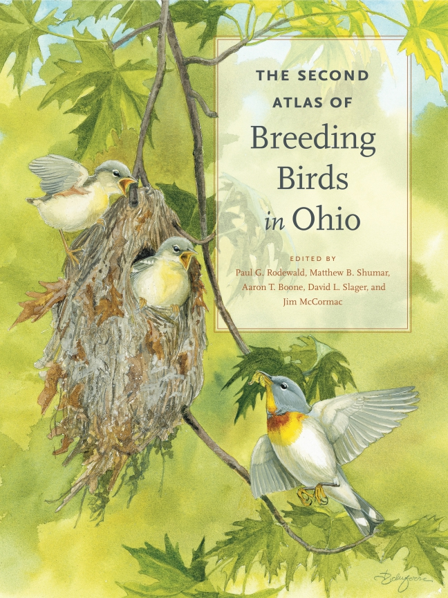

{::comment}
Hanging indent definition {:h } https://kramdown.gettalong.org/syntax.html#attribute-list-definitions
{:/comment}
{:h: style="margin-left:3em;text-indent:-3em"}

{::comment}
New tab safe launcher definition {:nt } https://kramdown.gettalong.org/syntax.html#attribute-list-definitions
https://stackoverflow.com/questions/15551779/open-link-in-new-tab-or-window
{:/comment}
{:nt: target="_blank" rel="noopener noreferrer"}

## Publications
{: align="center"}

# [Google Scholar profile](https://scholar.google.com/citations?user=8zJh4cMAAAAJ&hl=en){:nt }

# Preprints and articles in review

\*mentored undergraduate co-author for course-based research
{:style="margin-left:3em"}

MacPherson, M.P., Burgio, K.R., DeSaix, M.G., Freeman, B.G., Herbert, J., Herman, R., Jirinec, V., Shonfield, J., **Slager, D.L.**, van Rees, C.B., and J.E. Jankowski. [Predicting bird distributions under global change](https://www.biorxiv.org/content/10.1101/2021.05.26.445867v1){:nt }. *bioRxiv*
{:h }

# Peer-reviewed articles

Booth, H.\*, Yruretagoyena, L.\*, Kuruvilla, M.\*, and **D.L. Slager**. [On the marine feeding behavior and activity budgets of Belted Kingfishers (*Megaceryle alcyon*) during the post-fledging period](https://doi.org/10.1676/19-00023){:nt }. *Wilson Journal of Ornithology* 133:291-295
{:h }

Theobald, E.L., Hill, M.J., Tran, E., Agrawal, S., Arroyo, E.N., Behling, S., Chambwe, N., Cintrón, D.L., Cooper, J.D., Dunster, G., Grummer, J.A., Hennessey, K., Hsiao, J., Iranon, N., Jones, L. II, Jordt, H.L., Keller, M., Lacey, M.E., Littlefield, C.E., Lowe, A.T., Newman, S., Okolo, V., Olroyd, S.L., Peecook, B.R., Pickett, S.B., **Slager, D.L.**, Caviedes-Solis, I.W., Stanchak, K.E., Sundaravardan, V., Valdebenito, C., Williams, C.R., Zinsli, K., and S. Freeman. 2020. [Active learning narrows achievement gaps for underrepresented students in undergraduate science, technology, engineering and math](https://doi.org/10.1073/pnas.1916903117){:nt }. *Proceedings of the National Academy of Sciences* 117:6476-6483
{:h }

**Slager, D.L.**, Epperly, K.L., Ha, R.R., Rohwer, S., Wood, C., Van Hemert, C., and J. Klicka. 2020. [Cryptic and extensive hybridization between ancient lineages of American crows](https://doi.org/10.1111/mec.15377){:nt }. *Molecular Ecology* 29:956-969 [[preprint]](https://doi.org/10.1101/491654){:nt }
{:h }

**Slager, D.L.** 2019. [Seasonal and directional dispersal behavior in an ongoing dove invasion](https://doi.org/10.1111/jav.02332){:nt }. *Journal of Avian Biology* 2020:e02332 [[preprint]](https://doi.org/10.1101/517540){:nt }
{:h }

Battey, C.J., Linck, E.B., Epperly, K.L., French, C., **Slager, D.L.**, Sykes, P.W. Jr., and J. Klicka. 2018. [A migratory divide in the Painted Bunting (*Passerina ciris*)](https://doi.org/10.1086/695439){:nt }. *The American Naturalist* 191:259-268 [[preprint]](https://doi.org/10.1101/132910){:nt }
{:h }

**Slager, D.L.**, Rodewald, P.G., and P.J. Heglund. 2015. [Experimental effects of habitat type on the movement ecology and stopover duration of spring migrant Northern Waterthrushes (*Parkesia noveboracensis*)](https://doi.org/10.1007/s00265-015-1993-y){:nt }. *Behavioral Ecology and Sociobiology* 69:1809-1819
{:h }

**Slager, D.L.** and P.G. Rodewald. 2015. [Disjunct nocturnal roosting by a Yellow-rumped Warbler (*Setophaga coronata*) during migratory stopover](https://doi.org/10.1676/14-038.1){:nt }. *Wilson Journal of Ornithology* 127:109-114
{:h }

**Slager, D.L.** and J. Klicka. 2014. [Polyphyly of *Hylophilus* and a new genus for the Tawny-crowned Greenlet (Aves: Passeriformes: Vireonidae)](https://doi.org/10.11646/zootaxa.3884.2.8){:nt }. *Zootaxa* 3884:194-196
{:h }

**Slager, D.L.**, Battey, C.J., Bryson, R.W. Jr., Voelker, G. and J. Klicka. 2014. [A multilocus phylogeny of a major New World avian radiation: The Vireonidae](https://doi.org/10.1016/j.ympev.2014.07.021){:nt }. *Molecular Phylogenetics and Evolution* 80:95-104
{:h }

**Slager, D.L.** and J. Klicka. 2014. [A new genus for the American Tree Sparrow (Aves: Passeriformes: Passerellidae)](https://doi.org/10.11646/zootaxa.3821.3.9){:nt }. *Zootaxa* 3821:398-400
{:h }

**Slager, D.L.**, McDermott, M.E., and A.D. Rodewald. 2012. [Kleptoparasitism of nesting material from a Red-faced Spinetail (*Cranioleuca erythrops*) nest site](https://doi.org/10.1676/1559-4491-124.4.812){:nt }. *Wilson Journal of Ornithology* 124:812-815
{:h }

Bush, S.E., Harbison, C.W., **Slager, D.L.**, Peterson, A.T., Price, R.D., and D.H. Clayton. 2009. [Geographic Variation in the Community Structure of Lice on Western Scrub-Jays](https://doi.org/10.1645/GE-1591.1){:nt }. *Journal of Parasitology* 95:10-13
{:h }

# Books

Rodewald, P.G., Shumar, M.B., Boone, A.T., **Slager, D.L.**, and J. McCormac. 2016. [*The Second Atlas of Breeding Birds in Ohio*](http://www.psupress.org/books/titles/978-0-271-07127-5.html){:nt }. Penn State University Press, University Park, Pennsylvania 578 pp
{:h }

  
{: align="center"}

# Miscellaneous publications

Ottenburghs, J. and **D. L. Slager**. 2020. [How common is avian hybridization on an individual level?](https://doi.org/10.1111/evo.13985){:nt } *Evolution* 74:1228-1229
{:h }

**Slager, D.L.** 2020. Genomic and morphological analysis of an American crow hybrid zone. Doctoral Dissertation. University of Washington, Seattle, Washington
{:h }

**Slager, D.L.** 2011. [Movement ecology and stopover duration of Northern Waterthrush and Yellow-rumped Warbler during spring migration along the Upper Mississippi River](http://rave.ohiolink.edu/etdc/view?acc_num=osu1312987166){:nt }. Master's Thesis. The Ohio State University, Columbus, Ohio
{:h }

Preston, R.L., Clifford, R.J., Thompson, J.A., **Slager, D.L.**, Petersen, C.W., and G.W. Kidder. 2004. [CFTR mRNA expression in developing *Fundulus heteroclitus* embryos](https://mdibl.org/bulletin/bulletin_2004.pdf){:nt }. *Bulletin of the Mount Desert Island Biological Laboratory* 43:25-27
{:h }

# Invited presentations

**Slager, D.L.** 2017. Unlocking the genomes of museum specimens to address longstanding questions in avian biology. Thompson Hall Science and Mathematics Seminar, University of Puget Sound, Tacoma, Washington (talk)
{:h }

# Contributed presentations

**Slager, D.L.** 2019. Seasonal and directional dispersal behavior in an ongoing dove invasion. American Ornithological Society Conference, Anchorage, Alaska (talk)
{:h }

**Slager, D.L.**, Epperly, K.L., Klicka, J. 2018. Characterizing hybridization between Northwestern and American Crows using genetic data from 150 years of museum specimens. International Ornithological Congress, Vancouver, British Columbia, Canada (poster)
{:h }

**Slager, D.L.**, Epperly, K.L., Klicka, J. 2018. Characterizing hybridization between Northwestern and American Crows using genetic data from 150 years of museum specimens. American Ornithological Society Conference, Tucson, Arizona (talk)
{:h }

**Slager, D.L.** 2017. [Genomic insights into the evolutionary history of the Northwestern Crow](https://twitter.com/dlslager/status/935629629502775296){:nt }. British Ornithologists' Union Twitter Conference [#BOU17TC](https://www.bou.org.uk/bou17tc/){:nt } (twitter presentation)
{:h }

**Slager, D.L.** 2017. Genomic insights into the evolutionary history of the Northwestern Crow. FHL Seminar, University of Washington Friday Harbor Labs, Friday Harbor, Washington (talk)
{:h }

Battey, C.J., Linck, E.B., Epperly, K.L., French, C., **Slager, D.L.**, Sykes, P.W. Jr., Klicka, J. 2017. A migratory divide in the Painted Bunting (*Passerina ciris*). Rocky Mountain Biological Laboratory, Graduate Student Talks, Gothic, Colorado (talk)
{:h }

**Slager, D.L.**, Epperly, K.L., Ha, R.R., Rohwer, S., Van Hemert, C., and J. Klicka. 2017. Genomic insights into the evolutionary history of the Northwestern Crow. Society for the Study of Evolution, Society of of Systematic Biologists, and American Society of Naturalists Joint Meeting (Evolution 2017), Portland, Oregon (talk)
{:h }

Battey, C.J., Linck, E.B., Epperly, K.L., French, C., **Slager, D.L.**, Sykes, P.W. Jr., Klicka, J. 2017. A migratory divide in the Painted Bunting (*Passerina ciris*). Society for the Study of Evolution, Society of of Systematic Biologists, and American Society of Naturalists Joint Meeting (Evolution 2017), Portland, Oregon (poster)
{:h }

**Slager, D.L.**, Epperly, K.L., Ha, R.R., Rohwer, S., Van Hemert, C., and J. Klicka. 2017. Counting crows: a genomic look inside Seattle's taxonomic black box. 14th Annual Biology Graduate Student Symposium, University of Washington, Seattle, Washington (talk)
{:h }

Olmstead, R.G., Lu-Irving, P., Frost, L. and **D.L. Slager**. 2016. Patterns of interior continental disjunctions, examples from Lamiales, and an exploration of possible mechanisms. Botany 2016 Conference, Savannah, Georgia (talk)
{:h }

**Slager, D.L.**, Epperly, K.L., Rohwer, S. and J. Klicka. 2015. A phylogenomic assessment of introgression and species limits in the American/Northwestern Crow complex. Wilson Ornithological Society, Association of Field Ornithologists, and Society of Canadian Ornithologists Joint Meeting, Wolfville, Nova Scotia, Canada (talk; best student talk award)
{:h }

**Slager, D.L.**, Epperly, K.L., Rohwer, S. and J. Klicka. 2015. A phylogenomic assessment of introgression and species limits in the American/Northwestern Crow complex. Society for the Study of Evolution, Society of of Systematic Biologists, and American Society of Naturalists Joint Meeting (Evolution 2015), Guarujá, São Paulo, Brazil (talk)
{:h }

**Slager, D.L.**, Battey, C.J., Bryson, R.W. Jr., Voelker, G., and J. Klicka. 2014. A multilocus phylogeny of a major New World radiation: The Vireonidae. American Ornithologists' Union, Cooper Ornithological Society, and Society of Canadian Ornithologists Joint Meeting, Estes Park, Colorado (talk; session moderator)
{:h }

Battey, C.J., **Slager, D.L.**, Bryson, R.W. Jr., and J. Klicka. 2014. Paraphyly and migration in the Red-eyed Vireo superspecies. American Ornithologists' Union, Cooper Ornithological Society, and Society of Canadian Ornithologists Joint Meeting, Estes Park, Colorado (talk)
{:h }

**Slager, D.L.** 2014. A molecular phylogeny of the Vireos: New World colonization, basal diversification, and cryptic diversity. 11th Annual Biology Graduate Student Symposium, University of Washington, Seattle, Washington (talk)
{:h }

**Slager, D.L.**, Rodewald, P.G., and P.J. Heglund. 2012. Habitat-dependent stopover duration in the Northern Waterthrush (*Parkesia noveboracensis*). 5th North American Ornithological Conference, Vancouver, British Columbia, Canada (talk)
{:h }

**Slager, D.L.**, Rodewald, P.G., and P.J. Heglund. 2011. Stopover duration and departure decisions of Northern Waterthrush and Yellow-rumped Warbler during spring migration. American Ornithologists' Union Annual Conference, Jacksonville, Florida (talk)
{:h }

**Slager, D.L.**, Rodewald, P.G., and P.J. Heglund. 2011. Movement ecology of Northern Waterthrush (*Parkesia noveboracensis*) during spring migratory stopover. Association of Field Ornithologists/Cooper Ornithological Society/Wilson Ornithological Society Joint Meeting, Kearney, Nebraska (talk)
{:h }

**Slager, D.L.**, Rodewald, P.G., and P.J. Heglund. 2010. Movements and habitat use of Northern Waterthrushes and Yellow-rumped Warblers during spring migratory stopover along the Upper Mississippi River. American Ornithologists' Union Annual Conference, San Diego, California (poster)
{:h }

**Slager, D.L.**, Harbison, C.W., and D.H. Clayton. 2004. Fans, flies, and hitchiking lice: The importance of phoresis in population dynamics. University of Utah Research Experience for Undergraduates Summer Symposium, Salt Lake City, Utah (poster)
{:h }

Preston, R.L., Clifford, R.J., Thompson, J.A., **Slager, D.L.**, Petersen, C.W. and G.W. Kidder. 2003. Changes in apparent CFTR mRNA expression in developing killifish oocytes. Annual Meeting of the Society for Integrative and Comparative Biology, New Orleans, Louisiana (poster)
{:h }

# Species accounts in *Neotropical Birds Online*

\*mentored undergraduate co-author for course-based research
{:style="margin-left:3em"}

Nielsen, B.L.\* and **D.L. Slager**. 2019. [Volcano Junco (*Junco vulcani*)](https://doi.org/10.2173/nb.voljun1.01){:nt } in T.S. Schulenberg, ed. *Neotropical Birds Online*. Cornell Lab of Ornithology, Ithaca, New York
{:h }

Smith, C.\* and **D.L. Slager**. 2016. [Striped Sparrow (*Oriturus superciliosus*)](https://doi.org/10.2173/nb.strspa1.01){:nt } in T.S. Schulenberg, ed. *Neotropical Birds Online*. Cornell Lab of Ornithology, Ithaca, New York
{:h }

Quick, D.R.\* and **D.L. Slager**. 2015. [White-browed Brushfinch (*Arremon torquatus*)](https://doi.org/10.2173/nb.sthbrf2.01){:nt } in T.S. Schulenberg, ed. *Neotropical Birds Online*. Cornell Lab of Ornithology, Ithaca, New York
{:h }

Voelker, K.N.\* and **D.L. Slager**. 2015. [Olive Finch (*Arremon castaneiceps*)](https://doi.org/10.2173/nb.olifin1.01){:nt } in T.S. Schulenberg, ed. *Neotropical Birds Online*. Cornell Lab of Ornithology, Ithaca, New York
{:h }

Murray, D.S.\* and **D.L. Slager**. 2015. [Jamaican Vireo (*Vireo modestus*)](https://doi.org/10.2173/nb.jamvir1.01){:nt } in T.S. Schulenberg, ed. *Neotropical Birds Online*. Cornell Lab of Ornithology, Ithaca, New York
{:h }

Kim, H.J. and **D.L. Slager**. 2015. [Zapata Sparrow (*Torreornis inexpectata*)](https://doi.org/10.2173/nb.zapspa1.01){:nt } in T.S. Schulenberg, ed. *Neotropical Birds Online*. Cornell Lab of Ornithology, Ithaca, New York
{:h }

Olsen, D.G.\* and **D.L. Slager**. 2015. [Golden-winged Sparrow (*Arremon schlegeli*)](https://doi.org/10.2173/nb.gowspa1.01){:nt } in T.S. Schulenberg, ed. *Neotropical Birds Online*. Cornell Lab of Ornithology, Ithaca, New York
{:h }

Gunningham, H.R.\* and **D.L. Slager**. 2015. [Saffron-billed Sparrow (*Arremon flavirostris*)](https://doi.org/10.2173/nb.sabspa1.01){:nt } in T.S. Schulenberg, ed. *Neotropical Birds Online*. Cornell Lab of Ornithology, Ithaca, New York
{:h }

**Slager, D.L.** 2011. [Rufous-naped Greenlet (*Hylophilus semibrunneus*)](https://doi.org/10.2173/nb.rungre1.01){:nt } in T.S. Schulenberg, ed. *Neotropical Birds Online*. Cornell Lab of Ornithology, Ithaca, New York
{:h }

# Species accounts in *The Second Atlas of Breeding Birds in Ohio*

**Slager, D.L.** 2016. Gadwall (*Anas strepera*) in Rodewald, P.G., Shumar, M.B., Boone, A.T., Slager, D.L. and J. McCormac, eds. pp. 70-71 in [*The Second Atlas of Breeding Birds in Ohio*](http://www.psupress.org/books/titles/978-0-271-07127-5.html){:nt }. Penn State University Press, University Park, Pennsylvania
{:h }

**Slager, D.L.** 2016. Blue-winged Teal (*Anas discors*) in Rodewald, P.G., Shumar, M.B., Boone, A.T., Slager, D.L. and J. McCormac, eds. pp. 78-79 in [*The Second Atlas of Breeding Birds in Ohio*](http://www.psupress.org/books/titles/978-0-271-07127-5.html){:nt }. Penn State University Press, University Park, Pennsylvania
{:h }

**Slager, D.L.** 2016. Northern Shoveler (*Anas clypeata*) in Rodewald, P.G., Shumar, M.B., Boone, A.T., Slager, D.L. and J. McCormac, eds. pp. 80-81 in [*The Second Atlas of Breeding Birds in Ohio*](http://www.psupress.org/books/titles/978-0-271-07127-5.html){:nt }. Penn State University Press, University Park, Pennsylvania
{:h }

**Slager, D.L.** 2016. Great Egret (*Ardea alba*) in Rodewald, P.G., Shumar, M.B., Boone, A.T., Slager, D.L. and J. McCormac, eds. pp. 116-117 in [*The Second Atlas of Breeding Birds in Ohio*](http://www.psupress.org/books/titles/978-0-271-07127-5.html){:nt }. Penn State University Press, University Park, Pennsylvania
{:h }

**Slager, D.L.** 2016. Black-crowned Night-Heron (*Nycticorax nycticorax*) in Rodewald, P.G., Shumar, M.B., Boone, A.T., Slager, D.L. and J. McCormac, eds. pp. 126-127 in [*The Second Atlas of Breeding Birds in Ohio*](http://www.psupress.org/books/titles/978-0-271-07127-5.html){:nt }. Penn State University Press, University Park, Pennsylvania
{:h }

**Slager, D.L.** 2016. Northern Harrier (*Circus cyaneus*) in Rodewald, P.G., Shumar, M.B., Boone, A.T., Slager, D.L. and J. McCormac, eds. pp. 140-141 in [*The Second Atlas of Breeding Birds in Ohio*](http://www.psupress.org/books/titles/978-0-271-07127-5.html){:nt }. Penn State University Press, University Park, Pennsylvania
{:h }

**Slager, D.L.** 2016. Purple Gallinule (*Porphyrio martinicus*) in Rodewald, P.G., Shumar, M.B., Boone, A.T., Slager, D.L. and J. McCormac, eds. pp. 160-161 in [*The Second Atlas of Breeding Birds in Ohio*](http://www.psupress.org/books/titles/978-0-271-07127-5.html){:nt }. Penn State University Press, University Park, Pennsylvania
{:h }

**Slager, D.L.** 2016. Sandhill Crane (*Grus canadensis*) in Rodewald, P.G., Shumar, M.B., Boone, A.T., Slager, D.L. and J. McCormac, eds. pp. 166-167 in [*The Second Atlas of Breeding Birds in Ohio*](http://www.psupress.org/books/titles/978-0-271-07127-5.html){:nt }. Penn State University Press, University Park, Pennsylvania
{:h }

**Slager, D.L.** 2016. Spotted Sandpiper (*Actitis macularius*) in Rodewald, P.G., Shumar, M.B., Boone, A.T., Slager, D.L. and J. McCormac, eds. pp. 172-173 in [*The Second Atlas of Breeding Birds in Ohio*](http://www.psupress.org/books/titles/978-0-271-07127-5.html){:nt }. Penn State University Press, University Park, Pennsylvania
{:h }

**Slager, D.L.** 2016. Ring-billed Gull (*Larus delawarensis*) in Rodewald, P.G., Shumar, M.B., Boone, A.T., Slager, D.L. and J. McCormac, eds. pp. 182-183 in [*The Second Atlas of Breeding Birds in Ohio*](http://www.psupress.org/books/titles/978-0-271-07127-5.html){:nt }. Penn State University Press, University Park, Pennsylvania
{:h }

**Slager, D.L.** 2016. Great Horned Owl (*Bubo virginianus*) in Rodewald, P.G., Shumar, M.B., Boone, A.T., Slager, D.L. and J. McCormac, eds. pp. 204-205 in [*The Second Atlas of Breeding Birds in Ohio*](http://www.psupress.org/books/titles/978-0-271-07127-5.html){:nt }. Penn State University Press, University Park, Pennsylvania
{:h }

**Slager, D.L.** 2016. Common Nighthawk (*Chordeiles minor*) in Rodewald, P.G., Shumar, M.B., Boone, A.T., Slager, D.L. and J. McCormac, eds. pp. 214-215 in [*The Second Atlas of Breeding Birds in Ohio*](http://www.psupress.org/books/titles/978-0-271-07127-5.html){:nt }. Penn State University Press, University Park, Pennsylvania
{:h }

**Slager, D.L.** 2016. Belted Kingfisher (*Megaceryle alcyon*) in Rodewald, P.G., Shumar, M.B., Boone, A.T., Slager, D.L. and J. McCormac, eds. pp. 224-225 in [*The Second Atlas of Breeding Birds in Ohio*](http://www.psupress.org/books/titles/978-0-271-07127-5.html){:nt }. Penn State University Press, University Park, Pennsylvania
{:h }

**Slager, D.L.** 2016. Downy Woodpecker (*Picoides pubescens*) in Rodewald, P.G., Shumar, M.B., Boone, A.T., Slager, D.L. and J. McCormac, eds. pp. 232-233 in [*The Second Atlas of Breeding Birds in Ohio*](http://www.psupress.org/books/titles/978-0-271-07127-5.html){:nt }. Penn State University Press, University Park, Pennsylvania
{:h }

**Slager, D.L.** 2016. Great Crested Flycatcher (*Myiarchus crinitus*) in Rodewald, P.G., Shumar, M.B., Boone, A.T., Slager, D.L. and J. McCormac, eds. pp. 258-259 in [*The Second Atlas of Breeding Birds in Ohio*](http://www.psupress.org/books/titles/978-0-271-07127-5.html){:nt }. Penn State University Press, University Park, Pennsylvania
{:h }

**Slager, D.L.** 2016. Blue Jay (*Cyanocitta cristata*) in Rodewald, P.G., Shumar, M.B., Boone, A.T., Slager, D.L. and J. McCormac, eds. pp. 276-277 in [*The Second Atlas of Breeding Birds in Ohio*](http://www.psupress.org/books/titles/978-0-271-07127-5.html){:nt }. Penn State University Press, University Park, Pennsylvania
{:h }

**Slager, D.L.** 2016. Purple Martin (*Progne subis*) in Rodewald, P.G., Shumar, M.B., Boone, A.T., Slager, D.L. and J. McCormac, eds. pp. 284-285 in [*The Second Atlas of Breeding Birds in Ohio*](http://www.psupress.org/books/titles/978-0-271-07127-5.html){:nt }. Penn State University Press, University Park, Pennsylvania
{:h }

**Slager, D.L.** 2016. Barn Swallow (*Hirundo rustica*) in Rodewald, P.G., Shumar, M.B., Boone, A.T., Slager, D.L. and J. McCormac, eds. pp. 294-295 in [*The Second Atlas of Breeding Birds in Ohio*](http://www.psupress.org/books/titles/978-0-271-07127-5.html){:nt }. Penn State University Press, University Park, Pennsylvania
{:h }

**Slager, D.L.** 2016. Brown Creeper (*Certhia americana*) in Rodewald, P.G., Shumar, M.B., Boone, A.T., Slager, D.L. and J. McCormac, eds. pp. 306-307 in [*The Second Atlas of Breeding Birds in Ohio*](http://www.psupress.org/books/titles/978-0-271-07127-5.html){:nt }. Penn State University Press, University Park, Pennsylvania
{:h }

**Slager, D.L.** 2016. House Wren (*Troglodytes aedon*) in Rodewald, P.G., Shumar, M.B., Boone, A.T., Slager, D.L. and J. McCormac, eds. pp. 308-309 in [*The Second Atlas of Breeding Birds in Ohio*](http://www.psupress.org/books/titles/978-0-271-07127-5.html){:nt }. Penn State University Press, University Park, Pennsylvania
{:h }

**Slager, D.L.** 2016. Sedge Wren (*Cistothorus platensis*) in Rodewald, P.G., Shumar, M.B., Boone, A.T., Slager, D.L. and J. McCormac, eds. pp. 312-313 in [*The Second Atlas of Breeding Birds in Ohio*](http://www.psupress.org/books/titles/978-0-271-07127-5.html){:nt }. Penn State University Press, University Park, Pennsylvania
{:h }

**Slager, D.L.** 2016. Wood Thrush (*Hylocichla mustelina*) in Rodewald, P.G., Shumar, M.B., Boone, A.T., Slager, D.L. and J. McCormac, eds. pp. 330-331 in [*The Second Atlas of Breeding Birds in Ohio*](http://www.psupress.org/books/titles/978-0-271-07127-5.html){:nt }. Penn State University Press, University Park, Pennsylvania
{:h }

**Slager, D.L.** 2016. Cedar Waxwing (*Bombycilla cedrorum*) in Rodewald, P.G., Shumar, M.B., Boone, A.T., Slager, D.L. and J. McCormac, eds. pp. 342-343 in [*The Second Atlas of Breeding Birds in Ohio*](http://www.psupress.org/books/titles/978-0-271-07127-5.html){:nt }. Penn State University Press, University Park, Pennsylvania
{:h }

**Slager, D.L.** 2016. Northern Waterthrush (*Parkesia noveboracensis*) in Rodewald, P.G., Shumar, M.B., Boone, A.T., Slager, D.L. and J. McCormac, eds. pp. 350-351 in [*The Second Atlas of Breeding Birds in Ohio*](http://www.psupress.org/books/titles/978-0-271-07127-5.html){:nt }. Penn State University Press, University Park, Pennsylvania
{:h }

**Slager, D.L.** 2016. Mourning Warbler (*Geothlypis philadelphia*) in Rodewald, P.G., Shumar, M.B., Boone, A.T., Slager, D.L. and J. McCormac, eds. pp. 364-365 in [*The Second Atlas of Breeding Birds in Ohio*](http://www.psupress.org/books/titles/978-0-271-07127-5.html){:nt }. Penn State University Press, University Park, Pennsylvania
{:h }

**Slager, D.L.** 2016. American Redstart (*Setophaga ruticilla*) in Rodewald, P.G., Shumar, M.B., Boone, A.T., Slager, D.L. and J. McCormac, eds. pp. 372-373 in [*The Second Atlas of Breeding Birds in Ohio*](http://www.psupress.org/books/titles/978-0-271-07127-5.html){:nt }. Penn State University Press, University Park, Pennsylvania
{:h }

**Slager, D.L.** 2016. Chipping Sparrow (*Spizella passerina*) in Rodewald, P.G., Shumar, M.B., Boone, A.T., Slager, D.L. and J. McCormac, eds. pp. 402-403 in [*The Second Atlas of Breeding Birds in Ohio*](http://www.psupress.org/books/titles/978-0-271-07127-5.html){:nt }. Penn State University Press, University Park, Pennsylvania
{:h }

**Slager, D.L.** 2016. Vesper Sparrow (*Poocetes gramineus*) in Rodewald, P.G., Shumar, M.B., Boone, A.T., Slager, D.L. and J. McCormac, eds. pp. 408-409 in [*The Second Atlas of Breeding Birds in Ohio*](http://www.psupress.org/books/titles/978-0-271-07127-5.html){:nt }. Penn State University Press, University Park, Pennsylvania
{:h }

**Slager, D.L.** 2016. Savannah Sparrow (*Passerculus sandwichensis*) in Rodewald, P.G., Shumar, M.B., Boone, A.T., Slager, D.L. and J. McCormac, eds. pp. 412-413 in [*The Second Atlas of Breeding Birds in Ohio*](http://www.psupress.org/books/titles/978-0-271-07127-5.html){:nt }. Penn State University Press, University Park, Pennsylvania
{:h }

**Slager, D.L.** 2016. Brown-headed Cowbird (*Molothrus ater*) in Rodewald, P.G., Shumar, M.B., Boone, A.T., Slager, D.L. and J. McCormac, eds. pp. 450-451 in [*The Second Atlas of Breeding Birds in Ohio*](http://www.psupress.org/books/titles/978-0-271-07127-5.html){:nt }. Penn State University Press, University Park, Pennsylvania
{:h }